```{r setup, echo=FALSE, cache=FALSE}
library(knitr)
library(rmdformats)

## Global options
options(max.print="75")
opts_chunk$set(echo=FALSE,
               cache=TRUE,
               prompt=FALSE,
               tidy=TRUE,
               comment=NA,
               message=FALSE,
               warning=FALSE)
opts_knit$set(width=75)
```

# Préambule

## Pourquoi utiliser Github dans le cadre de Rzine

Depuis maintenant plusieurs années en SHS on entend beaucoup parler de Git, Github ou encore Gitlab, il s'agit quasiment d'un passage obligé lorsque l'on parle de traitement de la données.
Ces outils ont vocation à faciliter le partage et la collaboration autour de projets.
Les fonctionnalités proposées permettent notamment le suivi et la comparaison de version et un reviewing efficace.

## Objectif de cette fiche

Si au sein de certaines disciplines, comme notamment en informatique, ce que sont Git et Github et leur fonctionnement est très clair, ça l'est souvent beaucoup moins en science humaine.
Nous nous proposons ici d'en réaliser une présentation très succinte et présenter un pas à pas simplifier afin de faciliter la prise en main de ces outils dans le cadre spécifique du dépôt d'une fiche Rzine. Il ne s'agit en aucun cas d'aborder toutes les subtilités et la compléxité de Git.

R ne sera donc ici pas du tout le sujet, et aucune information sur la manière de renseigner une fiche Rzine ne sera donnée. Pour cela, rendez-vous sur la fiche : <a href="https://rzine.gitpages.huma-num.fr/add_publication/" target="_blank">__Référencer une publication sur Rzine__</a>


## Glossaire {#endnotes}

Ici quelques termes spécifiques à Git qu'il nous a semblé important d'expliciter un minimum.


# Bréve Introduction {-}


Git est un logiciel libre dont le premier développement date de 2005 crée par Linus Torvald (auteur du noyau Linux) dont la fonctionnalité est la gestion/contrôle de version^[La __gestion ou le conrôle de version__ renvoie à des pratiques dont l'objectif est de gérer les changement apporté à un fichier (généralement plutôt du code) au fil du temps. Par exemple dans un document word, chaque sauvegarde écrase la précédente, on peut aussi enregistrer une nouvelle version du document qui devient alors un autre fichier complétement indépendant. Dans les systèmes de contrôle de version on va conservé le même fichier mais garder trace de tous les changement réalisé, comme si on prenait et stocké une "photo", un "instantané" du fichier à chaque changement fichier].
Git permet le stockage des fichiers mais surtout toutes les modifications effectuées dans le temps. Par ailleurs, Git a été conçus dans l'optique de permettre et faciliter la collaboration entre les individus en intégrant les apports de chacun au projet.
Le fonctionnement de Git repose sur des lignes de commande et vous l'aurez compris il s'agit du coeur autour duquel se sont dévellopés les outils comme Github et Gitlab.

Github et Gitlab sont à l'origine des sites webs dont l'objectif est de venir renforcer l'aspect collaboratif de Git en proposant des fonctionnalités supplémentaires. Telles que que la gestion des tickets/issues, les releases, la documentation...
Ils offrent également une interface graphique à Git qui permet dans une certaine mesure de s'affranchir des lignes de commande sur lesquelles repose Git.

Github et Gitlab permettent glabalment la même chose. Gitlab est une alternative open source, permettant peut être un usage plus avancé et plus poussé, alors que Github est le site ayant popularisé Git, il s'agit de la référence mondiale et regroupe plusieurs millions d'utilisateurs.

# Pas à pas création dépot github {-}

Dans le cadre de ce tutoriel, nous vous proposons de suivre pas à pas le dépot de cette fiche sur un compte github. La démarche se fera à la fois en click-bouton et à l'aide des lignes de commande.
Cette fiche a été réalisé via R et un Rmarkdown, dans un projet R enregistré en local.

## Installation de Git

La première étape consiste à installer Git sur votre ordinateur.

Cela se fait très simplement quelque soit le système d'exploitation de votre machine. Il suffit de suivre les instructions parfaitement détaillées en français sur  <a href="https://git-scm.com/book/fr/v2/D%C3%A9marrage-rapide-Installation-de-Git" target="_blank">__la page d'installation de Git__ </a>

## Création d'un compte Github

Cette première étape est un passage obligé. Si ce fonctionnement peut faire, à raison, penser à un réseau social rassurez-vous les règles de la propirété intellectuelle sont très claires, et vous choisirez les projets à rendre publics ou privées, ainsi que les collaborateurs à éventuellement inviter. 

La création d'un compte se fait de manière tout à fait classique:

1. Rendez-vous sur le site de <a href="https://github.com/" target="_blank">__Github__ </a>
2. Cliquez sur sign up en haut à droite
3. Remplissez les champs demandés

## Créer un nouveau dépôt Github

Une fois connecté à Github vous arrivez sur la page de votre profil. 

<p class="center">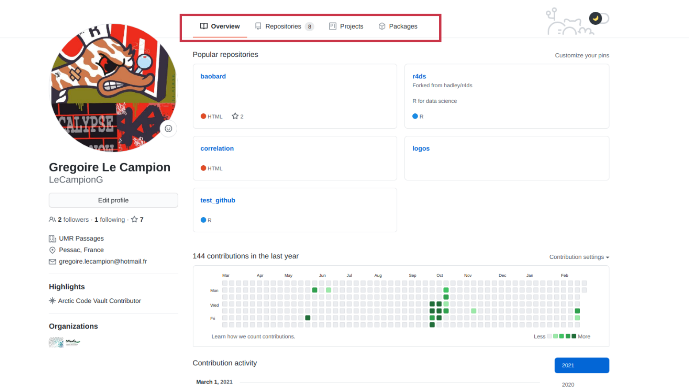 </p>

Pour créer un dépot^[Le __dépôt/répertoire/repo/repostory__ est l'espace où vous aller stocker vos fichiers. Il peut être local (le dossier au sein duquel avez enregistré votre fiche Rzine) ou en ligne (l'espace sur Github où vous allez importé vos fichiers). Vous pouvez stocker n'importe quel type de fichier au sein d'un dépôt.] rendez-vous sur la section _Repositories_ via le bandeau.

<p class="center"> </p>

Cette page recence tous les répertoires associés à votre compte, si vous venez de vous créer un compte, elle devrait donc être vide, sinon vous retrouverez ici tous vos différents dépôts. Pour en créer un, il suffit de cliquer sur _new_.

<p class="center">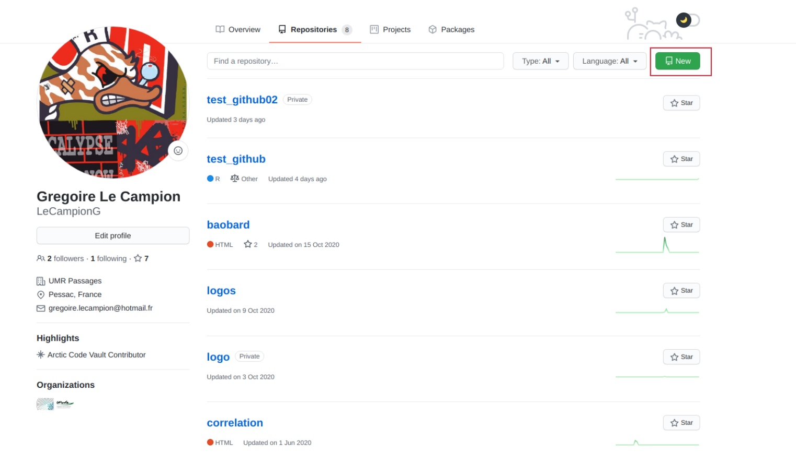 </p>


C'est sur cette page à laquelle vous venez d'accéder après avoir cliqué sur _new_ que vous allez véritablement créer votre nouveau dépôts : lui donner un nom, déterminer son statut privé ou public...

<p class="center">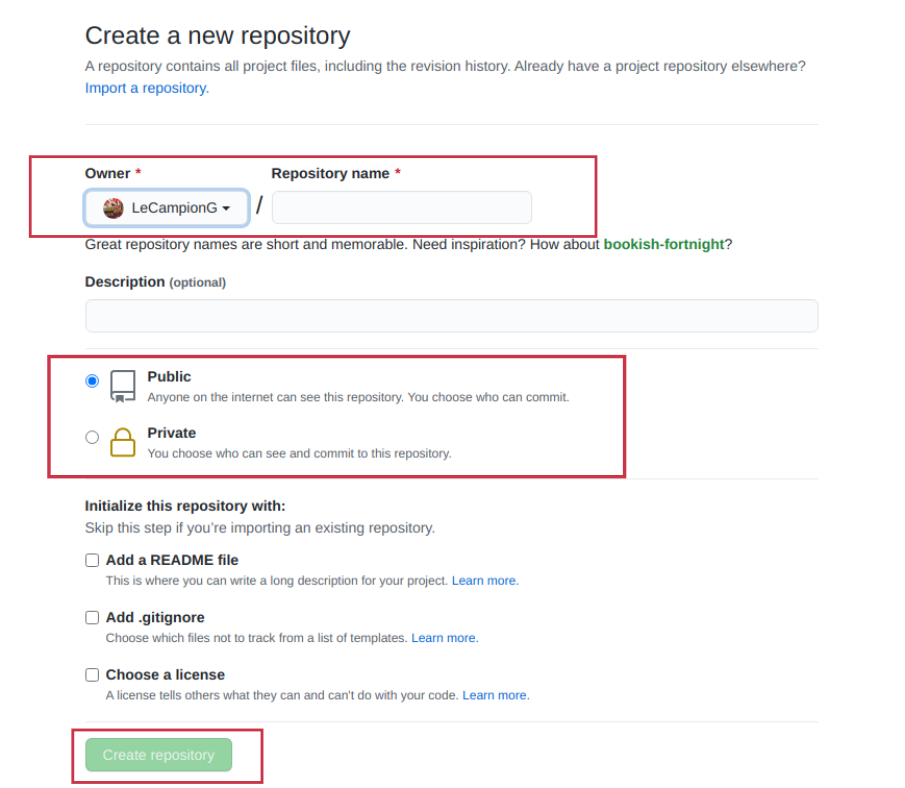 </p>

Après avoir cliqué sur _Create repository_ vous aurez donc crée avec succès un nouveau dépôt Github. 
Vous verrez cette nouvelle page s'afficher. Elle vous orientera vers différentes marche à suivre. Par ailleurs, cette page vous fournis en grande partie les lignes de commande et les informations que nous allons utilisé pour remplir votre répertoire.

<p class="center">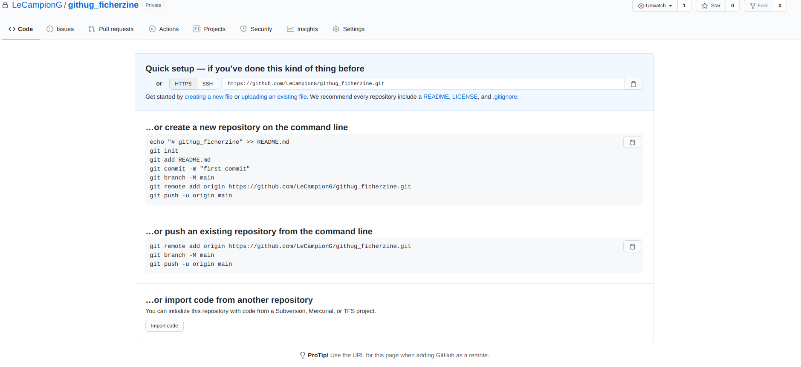 </p>

<div class="alert alert-info" role="alert">
Tant que vous n'aurez rien importé dans votre dépôt, c'est cette page avec ces informations succintes qui constituera la page d'acceuil de votre dépôt.
</div>

## Importer des élements dans votre répertoire Github depuis votre ordinateur

Pour réaliser cet import, nous allons temporairement laissé Github de côté.
Vous avez donc réaliser en local votre fiche Rzine, et disposez d'un dossier contenant tous les différents éléments.
L'objectif est donc d'importer facilement ce dossier (dans son intégralité) dans votre répertoire.
Pour ce faire nous allons utilisé git et ses lignes de commande basique. 

<div class="alert alert-warning" role="alert">
Cette procédure fonctionne dans le cadre d'une fiche Rzine, mais fonctionne exactement de la même manière pour n'importe quel autre projet.
</div>

1- Il vous faut en premier lieu ouvrir votre terminal ou invite de commande

C'est la façon la plus efficace d'intéragir avec Github depuis votre ordinateur. Cette interface, si on est pas habitué peut effectivement rebuté, mais l'apprentissage pour réaliser certaines opérations basiques se fait rapidement. 
En revanche, chaque système d'exploitation possède sa propre interface en ligne de commande :

- Windows : l'invite de commande. Celle-ci peut être lancée en utilisant la touche Windows et en tapant Invite de commande (ou cmd) avant de sélectionner l'option dans la liste qui apparaît. 

- MacOS : le terminal. On le trouvera dans Applications > Utilitaires.
- Linux : Généralement, on peut lancer un terminal avec le raccourci clavier Ctrl + Alt + T. Si cela ne fonctionne pas, recherchez Terminal dans les applications ou via les outils de recherche.

<div class="alert alert-danger" role="alert">
Attention Windows utilise certaines conventions différentes de celles choisies par Linux et MacOS, les commandes peuvent donc varier légèrement (par exemple, dans Windows, on utilisera l'anti-slash  pour indiquer un sous-répertoire alors que Linux et MacOS utiliseront "/").
<hr>
Attention sur Linux pour faire un copié-collé dans le terminal il faut utiliser le raccourci ctrl+shift+c pour collé et ctrl+shift+v pour collé.
</div>

Voici à quoi ressemble un terminal :

<p class="center">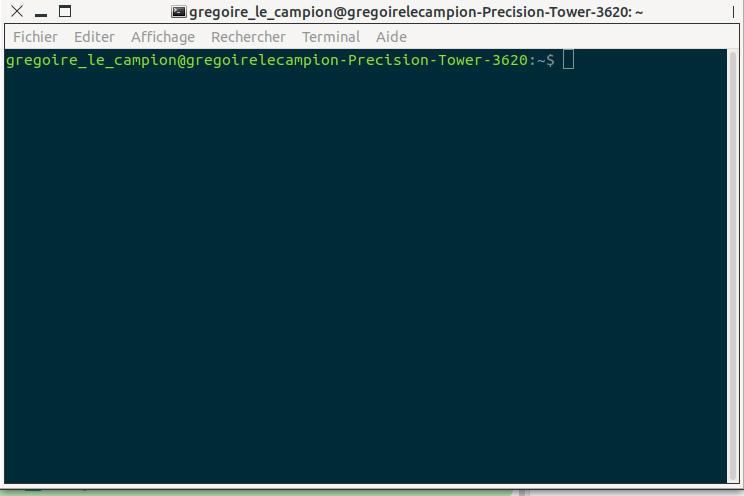 </p>

2- Nous allons maintenant nous placer dans le dossier au sein duquel vous avez enregistré votre projet que vous souhaitez importer. Pour ce faire nous utiliserons cette ligne de commande

`cd "chemin/vers/votre/dossier"`

Il faudra bien sur remplacer le chemin entre "" par le chemin correspondant à votre dossier sur votre ordinateur.

3- Il faut ensuite lancer Git :

`git init`

Cette commande permet d'initialiser Git dans le dossier au sein duquel vous vous trouvez, cela implique que toutes les opérations que vous réaliserez avec Git dans ce dossier seront sauvegardés.

<div class="alert alert-warning" role="alert">
S'il s'agit de votre toute première connexion, vous verrez un message d'alerte s'afficher. Ce dernier vous demandera de vous authentifier, ce qui permettra de faire le lien avec votre Github et vous indiquera les lignes de commandes à utiliser :
<hr>
`git config --global user.email "Vous@exemple.com"`
`git config --global user.name "Votre Nom"`
</div>

4- Une fois git initialisé, il faut lui indiquer l'URL du dépôt Github au sein duquel vous souhaitez importer vos fichier et dossier.

`git remote add origin https://github.com/LeCampionG/github_fiche_rzine.git`

Cette url est celle indiqué dans la barre d'adresse de votre navigateur lorsque vous êtes connecté à Github et dans votre dépôt. Elle est également indiqué dans les premières informations affichées lorsque vous avez créée votre dépôt.

<p class="center">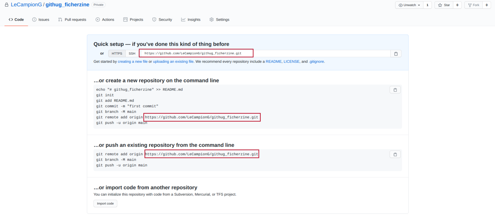 </p>

5- Nous indiquons maintenant ce que nous souhaitons envoyer, importer dans notre dépôt

Cela se fait en plusieurs étape. D'abord spécifier les fichiers à envoyer.

Pour importer l'intégralité du dossier nous utiliserons la commande :

`git add --all`

<div class="alert alert-info" role="alert">
Si vous souhaitez envoyer un fichier particulier, par exemple notre rmd nous écririons :
`git add rzine_tuto_github.Rmd`
</div>


Une fois avoir précisé les éléments à transfèrer nous allons devoir réaliser un _commit_^[Le __commit__ est l'enregistrement des changements effectué sur un fichier. Il s'agit de l'"instantané", du point de sauvegarde des changement qui ont été réalisé. C'est sur le commit que repose complétement le système de contrôle de version et donc plus largement les outils comme Git et Github.]. Avec cette commande nous allons réalisé un instantané (au sens photographique) des fichiers sur lesquels nous travaillons. Il s'agit en fait d'une sauvegarde à un instant "t" des différents éléments du dossier.

`git commit -m "1er import des fichiers"`

`-m "un_texte"` permet simplement d'expliciter l'action, en l'associant à un message, une description.


6- La dernière étape consiste à rendre tout cela visible et accessible, on parle de _pusher_^[ __Push/"Pusher"__ est le fait d'envoyer les commits (modifications réalisés) sur le dépôt est donc de les rendre visibles.] les fichiers :

`git push -u origin master`

`master` correspond à l'endroit où nous allons envoyé nos fichiers.

Pour valider votre import, il faudra fournir votre identifiant et votre mot de passe

Votre dépôt contient désormais les fichiers que vous aviez en local sur votre ordinateur.


<div class="alert alert-info" role="alert">
Il est possible de s'affranchir du code Git, et tout réaliser via Github en click. Néanmoins, cette méthode peut s'avérer très fastidieuse, l'importation se faisant fichier par fichier cela peut rapidement devenir chronophage.
<hr>
Si intéragir avec votre terminal ou invite de commande ne vous convient pas, il existe également des interfaces graphiques pour Git qui permettent globalement la même chose, mais vous devrez malgré tout utiliser les lignes de commande avec ces applications.
</div>

# Les "Issues" Github {-}

Les issues Github correspondent à un espace d'échange autour de votre projet. C'est un espace ouvert à tous si votre dépôt est public ou seulement à vous-même ou aux personnes auxquelles vous aurez donné accès dans le cas d'un dépôt privé.

La plupart du temps, les issues servent à faire remonter des bugs, signaler des idées de développement, d'amélioration...

Plus que de simples commentaires, il s'agit d'espaces d'échanges à l'image d'un forum. Vous pourrez répondre, commenter, ainsi que maintenir ouverte ou clôturer l'issue.

Pour ouvrir une issue, il faut d'abord se rendre, depuis la page web, du dépôt dans la section correspondante via le bandeau.

<p class="center"> </p>

Cette page va recenser toutes les issues associées à votre projet.
Pour créer et ouvrir une issue, il suffit simplement de cliquer sur _New issue_.

<p class="center">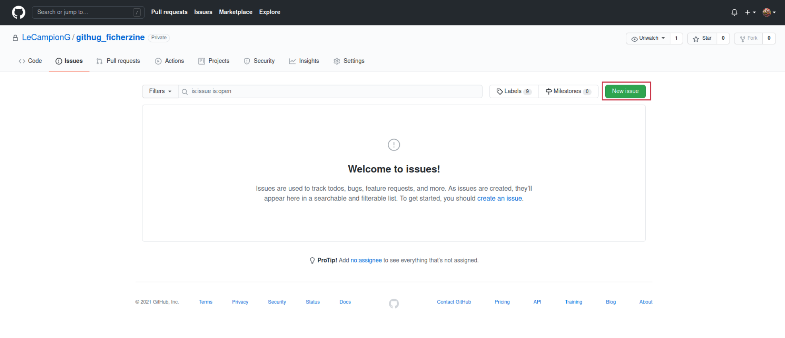 </p>

Vous pourrez donner un titre à votre issue, tagger une personne, donner une étiquette... Une fois rédigée, cliquez sur _Submit new issue_.

<p class="center">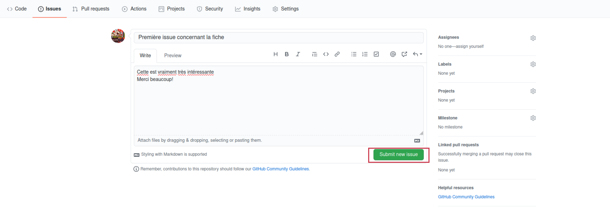 </p>

Pour répondre, modifier, clôturer (ou ré-ouvrir) une issue, il suffit de cliquer dessus et réaliser une de ces actions par clic-bouton.

<p class="center">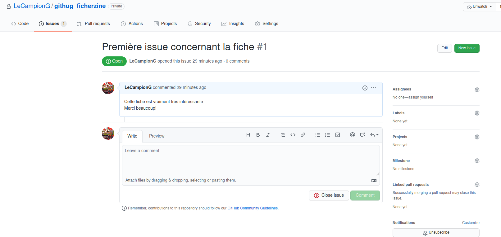 </p>

# Branche et Pull requests {-}

## Les branches

Git et Github permettent de faire des branches^[Une __branche__ est une ramification indépendante de votre dépôt source. Elle permet donc de modifier en parallèle les fichiers ou la structure du dépôt sans affecter les autres branches. C'est extrêment utile d'autant qu'elles peuvent ensuite être re-fusionnées.]
Cela s'avère très utile lorsque l'on travaille à plusieurs ou que des corrections de contenu sont nécessaires.

Dans Gitub, la création de branches peut se faire facilement.
Depuis l'accueil de votre dépôt (onglet <> code) cliquez sur le bouton encadré en rouge, dans l'image ci-dessous. Ce bouton permet, entre autres choses, de créer des branches.

<p class="center">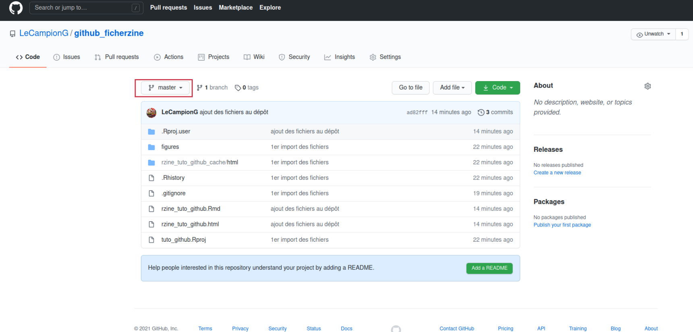 </p>

Un menu déroulant apparait : pour créer une branche, il suffit d'écrire son nom puis de cliquer sur __Create branch__.

<p class="center">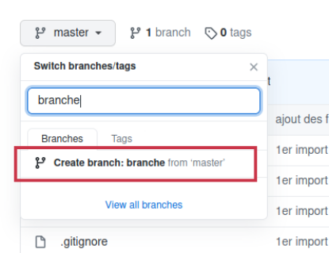 </p>

Cet onget vous indiquera dans quelle branche vous vous trouvez et vous permettra également de naviguer entre les branches.

% ICI JE PENSE QUE L'ON PEUT ETRE PLUS CLAIRS
En procédant de cette manière, les branches créées seront des copies des branches depuis lesquelles vous les avez produites. Cela suppose que s'il y a des modification à faire il faut les faire depuis Github ou supprimer un fichier et le ré-importer dans la branche. Ce n'est pas toujours le plus efficace.

La même chose est possible en ligne de commande, et, ce, de manière plus optimisée (même si, nous n'aborderons pas ici toute la complexité et les possibilités de la création de branches avec les fonctions Git).

Pour faciliter la compréhension du principe prenons l'exemple de cette fiche Rzine.
Nous avons déposé dans un dépôt Github une première version de nos travaux. Nous souhaitons la faire relire par un collègue, ou y apporter nous-même des modifications sans toutefois écraser la première version.
Nous allons donc opérer les différentes modifications en local sur notre ordinateur. Une fois satisfaits, nous allons créer une branche au sein de laquelle nous allons importer les fichiers modifiés sans écraser les premiers travaux. Le très grand intérêt à cela c'est que nous pourrons par la suite comparer les deux branches et éventuellement les fusionner.

Commencez par vous placer dans le bon répertoire (ici le dossier tuto_github localisé dans le répertoire Rzine appartenant lui-même au répertoire gregoire et ainsi de suite) :

`cd "/mnt/9A8C6DB98C6D9115/gregoire/Rzine/tuto_github"`


Pour créer une nouvelle branche (que nous choisissons ici d'appeler "correction"), il suffit d'écrire :

`git checkout -b correction`

Notons que le répertoire actif bascule alors automatiquement vers la branche nouvellement créée.
Il est alors possible d'importer un fichier ou un dossier dans cette nouvelle branche, en suivante la procédure utilisée en amont pour la branche principale : 

* `git add rzine_tuto_github.Rmd`, pour l'import d'un fichier unique
* `git add --all`, pour l'import d'un dossier et de l'ensemble des éléments qu'il contient

% je ne comprends pas ce que tu voulais dire ici :
Attention, il est nécessaire d'indiquer à Git quel fichiers ont été retravaillés

La commande `git status` peut être très pratique pour avoir un aperçu des fichiers qui ont subi des modifications.

Comme précédemment, il faut réaliser un commit, qui permettra notamment de voir et prendre en compte toutes les modifications réalisées sur le fichier :

`git commit -m 'fichier sur lequel réaliser les modifications'`

Les changements réalisés sur la branche annexe "correction", s'ils sont validés, peuvent être renvoyés du répertoire local vers une branche du dépôt GitHub (ici, la branche d'origine) :

`git push origin correction`

Notons, enfin, qu'il est aisé de naviguer d'une branche à l'autre grâce à la commande checkout. Ici, on cherche par exemple à retourner sur la branche master, qui correspond au dernier embranchement dans lequel un commit a été effectué :

`git checkout master`


## Pull requests

Avec la création de branches, vous pouvez donc modifier comme vous le souhaitez un fichier tout en le conservant intact dans une autre branche.

Une fois les corrections, les modifications... terminées, il peut être utile de comparer les différents éléments et fusionner les fichiers modifiés.
On peut alors réaliser un pull request (qui recherche les modifications faites dans les répertoires qui se raccrochent à un dépôt et les fusionne). 

Github propose une interface graphique intéressante pour réaliser cette opération (elle est bien évidemment aussi faisable en ligne de commande). Pour ce faire, utilisez le bandeau et cliquez sur le bouton _Pull requests_.

<p class="center">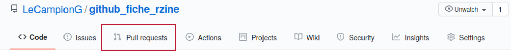 </p>

<div class="alert alert-warning" role="alert">
Pour réaliser un pull request, il faut au moins une autre branche à fusionner, et que les deux branches aient au moins un élément dissemblable.
</div>

Cliquez sur _New pull request_ pour lancer une nouvelle comparaison :

<p class="center">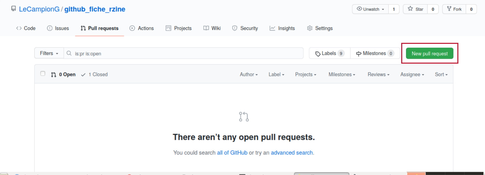 </p>

Il faut désormais choisir les deux branches à comparer :

<p class="center">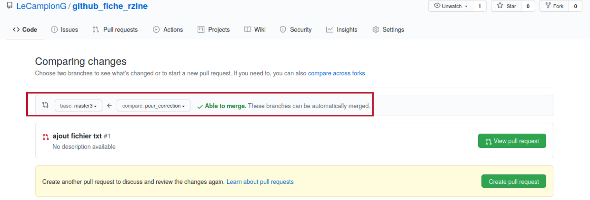 </p>

Une fois le pull réalisé, vous verrez les différences éventuelles entre vos deux branches : les modifications des fichiers similaires, les fichiers présents dans la 2ème branche mais pas la première...

<p class="center">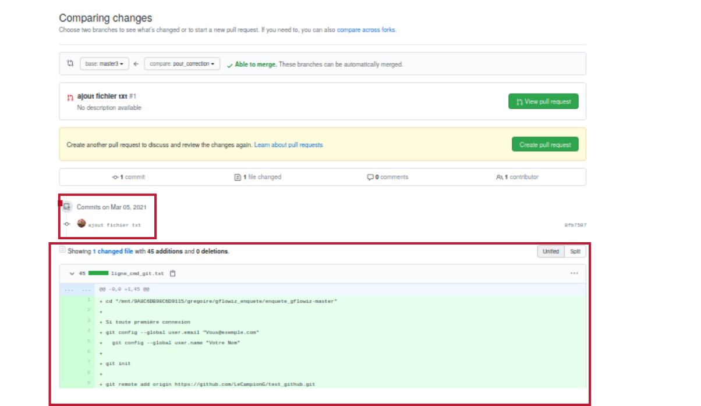 </p>

Si cela vous convient, cliquez sur le bouton _Create pull request_.

<p class="center">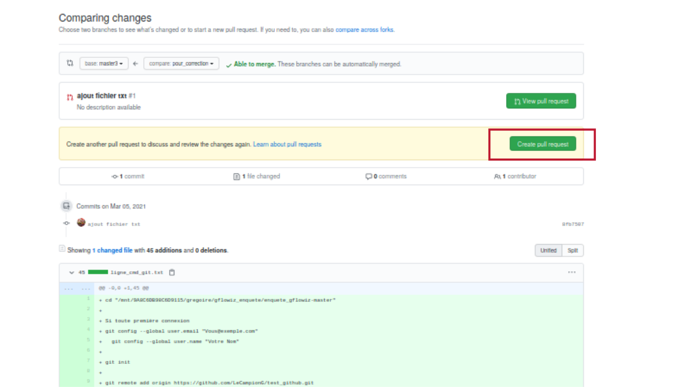 </p>

Vous pouvez ensuite commenter, décrire votre demande et la soumettre en cliquant sur _Create pull request_.

<p class="center">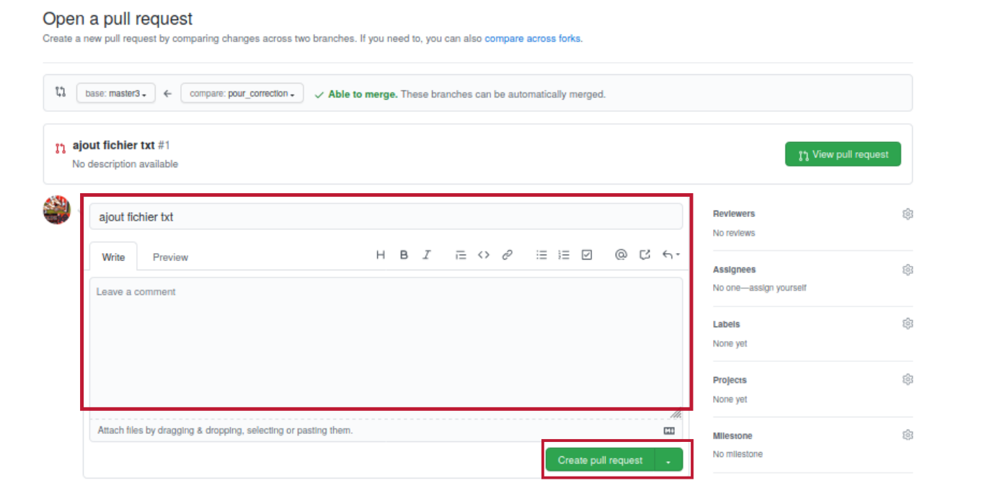 </p>

Vous avez donc fait une demande qui apparaitra dans votre section _Pull requests_. 

<p class="center">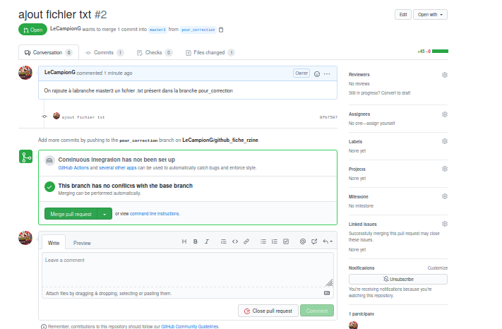 </p>

% pas sûre de comprendre ce que tu voulais dire dans la deuxième partie de la phrase?
Vous pouvez échanger des pull request de la même manière qu'avec les issues, avec l'avantage que les pull requests permettent de visualiser ce qui sera fusionné.

Si cela vous convient, vous pouvez accepter les modifications en cliquant sur _Merge pull request_.

<p class="center">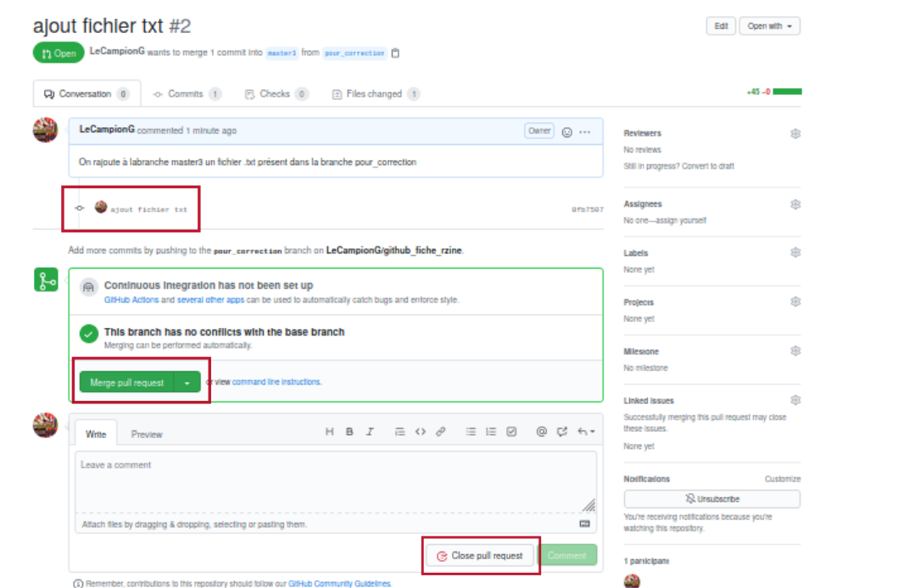 </p>

Les deux branches sont alors fusionnées.

Il est également possible de refuser un pull request (et donc d'ignorer les modifications de fichiers associées) en cliquant sur _Close pull request_


# Liste non exhaustive des commandes Git pouvant être utiles {-}

`git init` : Initialise un nouveau dépôt Git. C'est seulement après avoir entré cette commande que vous pourrez commencer à travailler avec Git.

`git config` : Raccourci de "configurer", cette commande est particulièrement utile quand vous paramétrez Git pour la première fois.

`git help` : Permet d'afficher les 21 commandes les plus courantes de Git. Vous pouvez aussi être plus spécifique et saisir par exemple `git help init` ou tout autre terme pour voir comment utiliser et configurer une commande spécifique Git.

`git status` : Vérifie le statut de votre dépôt. Voir quels fichiers sont à l’intérieur, quelles sont les modifications à commiter, et sur quelle branche du dépôt vous êtes en train de travailler.

`git add` : Cette commande n’ajoute pas de nouveaux fichiers dans votre dépôt. Elle "porte" de nouveaux fichiers à l’attention de Git. Après avoir ajouté des fichiers, ils sont inclus dans les « instantanés » du dépôt Git.

`git commit` : Une des commandes les plus importante de Git. Après avoir effectué toute sorte de modifications, elle permet de prendre un “instantané” du dépôt (instantané au sens de photographie et donc de sauvegarde).

`git push` : Si vous travaillez sur votre ordinateur local, et voulez que vos commits soient visibles aussi en ligne sur Github, vous "push"ez les modifications vers Github avec cette commande. Se sont les fichiers portés à l'attention de Git avec `git add` qui seront "push"ez

`git branch` : Cette commande vous permet de construire une nouvelle branche, ou une chronologie des commits, des modifications, des ajouts de fichiers...

`git checkout` : Permet littéralement de vérifier un dépôt dans lequel vous n’êtes pas. C’est une commande de navigation qui vous permet de vous déplacer vers le répertoire que vous voulez vérifier et au sein duquel vous souhaitez travailler. Permet aussi la création d'une branche.

`git merge` : Lorsque vous avez fini de travailler sur une branche, vous pouvez fusionner vos modifications vers la branche master, qui est visible pour tous les collaborateurs.

`git pull` : Permet un export en local de la version la plus à jour de votre dépôt.


```{js, echo=FALSE}
$(document).ready(function() {
  $('.footnotes ol').appendTo('#endnotes');
  $('.footnotes').remove();
});
```
